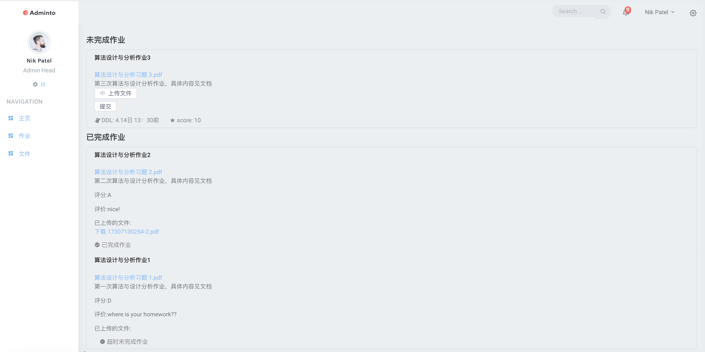

# Coursedetail

主要完成的是课程的具体信息，在Sprint1阶段包含3个子页面
- 主页：简单地介绍课程内容，和教师组织结构
- 文件：发放PPT/作业
- 作业：同学提交作业

## 文件结构
1. 使用组件库：[iview](https://www.iviewui.com)

```
npm install view-design --save
```

在main.js里引用该组件库

2. 在没有合并前coursedetail页面组织如下

>**主页面**
>/src/views/home.vue 引用 layout 和 router-view
>>**layout**和ncr做的home界面保持风格一致
>>/src/layouts/main.vue 组织nav-bar side-bar right-bar footer
>>>**sidebar**
>>>/src/components/side-bar 组织 side-nav  和 scrollbar组件
>>>>/src/components/side-nav 构造3个导航，通过router跳转定义右侧界面的显示内容
>>>
>>>**nav-bar right-bar footer**
>>>都在/src/componets/下
>>
>>在/src/components/**mainpage document homework** 定义router-view，显示右边导航得到的界面

在/src/router/routers.js里定义coursedetail的三个子跳转，跳转的组件。设置homepage为默认显示的页面

## 跳转界面(以算法分析课为例)
- mainpage


mainpage文件包括course数据，course数据有name和description属性，需要后端传送这两个属性，爬取的时候**name**直接对应课程名称，**description**是**html语句**，直接通过v-html插入，比较易于显示粗体斜体高亮链接等性质

- document


document文件包括course和select数据，course数据有name和docs属性，需要后端传参。

docs属性是一个列表，里面有两种类型的dict，一种是文件夹，一种是文件
>- 文件夹有属性title(文件夹的名称)，expand:true，childern:该文件夹包含的内容，可以是文件也可以是子文件夹。
>- 文件有title属性(文件的名字)，urls:文件指向的下载链接。elearning上面的链接可以直接爬取，不需要任何登陆cookie直接可以获得，直接传过来就可以

操作(methods):
>- 直接点击某个文件，可以通过构造a标签进行urls指向的文件下载
>- 通过多选文件前的复选框，可以一次选择多个文件，点击下载button，一起下载(**相比elearning的一个优点**)
>
>
>
>图中展示了选择三个文件，进行一次下载的情况

- homework



homework文件包括course数据，course数据包含name,done,not_done数据，done数据包含已经完成的作业,not_done包含尚未完成的作业，需要后端传参

>- done
>  目前已经完成的作业包括title（作业名称），description（对作业的描述），content（作业内容），ddl(作业的ddl)，score（作业的满分分数），grade（作业的登记），comment（作业的评价），finish（作业完成情况 true/false），submission（已经提交作业的名字&链接 html格式）
>
>- not_done
>目前尚未的作业包括title（作业名称），description（对作业的描述），content（作业内容），ddl(作业的ddl)，score（作业的满分分数）
>
>  包括一个上传文件和提交文件的按钮，但是具体还没有完成上传作业机制，只是界面

两种情况的数据各构成一个List展示在页面上


## 后续
1. 后端爬虫和传参的具体处理
2. 作业的提交和状态的转换
3. 更多跳转页面 例如：讨论