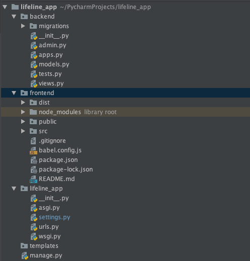
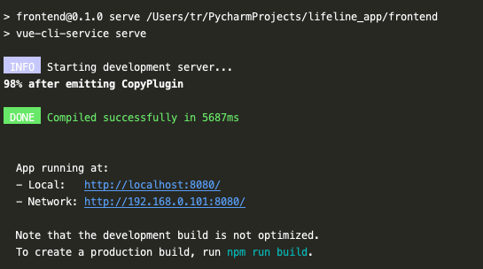

#### Vue.js + Django 框架


##### 0 前言

- 如果只需要移植框架：只需要参考 **1-3** 三个部分内容

- 如果框架有问题：可参考在实现 **3** 后利用 **4** 快速搭建

  

##### 1 文件结构



已经做好的架构包括三个部分：

1. **backend** 后端文件
2. **frontend** vue.js 前端文件
3. **lifeline_app** 项目文件


##### 2 移植架构

- 命令行

  直接拷贝lifeline_app整个文件夹即可

- **ide**：以Pycharm为例
  1. 新建django项目 lifeline_app
  2. 将 lifelineapp/..内的所有文件拷贝覆盖到pycharm项目文件夹下


##### 3 初始化

1. **安装django**

```shell
pip install django # 如果用 pycharm 这一步不需要了
pip install django-cors-headers # 解决跨域的问题，后面会用到
```

2. 在lifeline_app/lifeline_app/settings.py 中设定自己的数据库初始化参数

   

3. **安装vue.js**

   以下为我自己的方法，仅供参考

   1. 下载并安装[node](https://nodejs.org/en/)

   2. node包集成了npm

      ```shell
      sudo npm init -f #初始化npm
      sudo npm install -g cnpm --registry=https://registry.npm.taobao.org #装镜像快一点
      sudo cnpm install -g webpack
      sudo cnpm install -g vue 
      sudo cnpm install -g @vue/cli
      ```

   3. 运行vue

      ```shell
      cd frontend
      npm run serve
      ```

      运行的正确截图：

      


##### 4 构建流程

由于我的框架都是在macos系统上开发。所以不确定是否一定有移植性。如果有遇错误，可以参考如下步骤自行重新搭建。

```shell
django-admin startproject lifeline_app #生成lifeline_app文件夹
python manage.py startapp backend #生成backend文件夹
vue create frontend #生成frontend文件夹
```


##### 5 完成

在lifeline_app目录下运行

```shell
python manage.py runserver
```

如果成功加载local host **http://127.0.0.1:8000/** 即为成功

因为现在啥也没写点开是空白的。

