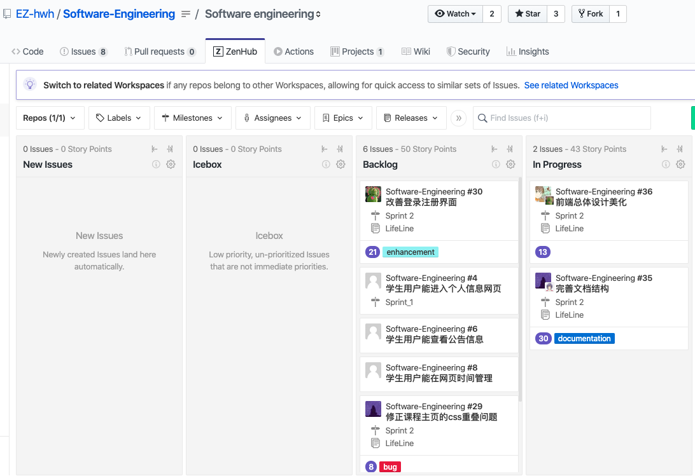

#Zenhub 使用指南
请根据本指南的要求在`zenhub`中管理本项目

##安装

我们推荐使用`chrome`浏览器扩展程序的方式安装`zenhub`
- 在`chrome`网上应用店搜索扩展程序`Zenhub for Github`

- 安装并启用`Zenhub for Github`并使用你的`Github`账户登陆

- 使用chrome点开我们的项目地址，你可以看到项目的选项栏目中出现了`Zenhub`选项

- 点击后看到如下图的界面，即表示**安装成功**：

  

## 使用

###添加issue

- **在每次任务开始前，你需要进入zenhub管理界面，添加新issue**
- 点击页面绿色按钮，添加`new issue`

- 请注意issue的填写规范：
  - **issue**：title简要概括任务的内容，**write部分列出任务的目标**
  - **Labels**：任务的分类
  - **Assigners**：将任务指派给自己或开发组其它成员
  - **Milestone**：请选择当前的sprint
  - **Estimates**：根据任务难易估计其耗时，平均值为20
  - **Release**：默认选择Lifeline开发项目

### 管理issue

- 添加完成后，issue将出现在`New issues`板块

- **请根据实际需求将issue拖动至不同的板块**

  - **Icebox**：尚未进行的任务，低优先级
  - **Backlog**：尚未进行的任务，高优先级，即将开始
  - **In Progress**：正在进行中的任务
    - **在任务进行阶段，需要对issue的内容保持更新，请参考此条[issue](https://github.com/EZ-hwh/Software-Engineering/issues/35)**
  - **Review/QA**：任务有待测试
    - 任务完成时：
      1. 请pull到自己的分支
      2. 自行合并代码保证任务在主分支下运行或通知相关开发组成员合并框架
      3. **提起`pull request`**，同时将项目拖至本栏。
      4. 通知相关的开发组成员测试。
      5. 测试完毕后填写测试成员需填写`review`，若代码无误，则拖至**done**板块；若有误，则返回**in progress**板块
  - **Done**：任务已经完成测试，可以`merge request`，并通知开发组其它成员同步`master branch`。等所有人都完成同步，把issue拖至**closed**板块

  - **Closed**：已经完成的工作