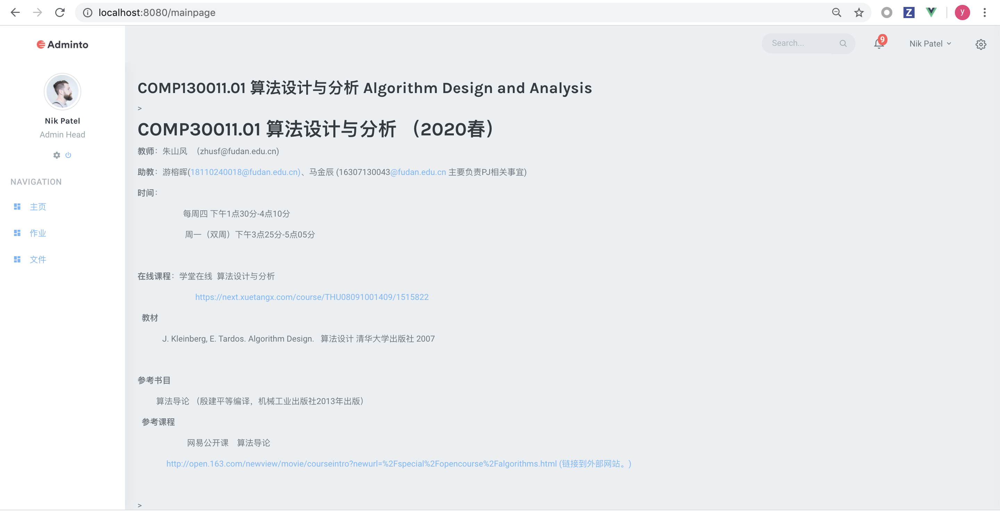

# frontend

以下文档主要交代前端的开发流程以及各页面技术实现的细节


## 环境配置

### 安装需要的包

```
npm install
```

`package.json`是新的，应该用`npm install`就可以安装好新的包。如果不能运行且出现之前没有install会出现的错误提示的话，试一下单独安装以下几个包（正常来说应该用不到）

```
npm install vue bootstrap-vue bootstrap
npm install sass-loader -D
npm install node-sass -D / cnpm install node-sass -D
npm install vue-perfect-scrollbar
```


## 运行

### 开发前端测试

```shell
npm run serve //在frontend文件夹下
```

### 打包生成`dist`文件夹
```shell
npm run build //在frontend文件夹下
```

### 前后端交互测试

```shell
python manage.py runserver //在项目文件夹下 需要先做上一步打包
```


## 各页面说明


### 登陆注册

---

登陆注册页面的主要设计存放在`frontend/src/views/login`，`frontend/src/views/register`文件夹下。页面渲染中包括自定义的`component`：s`frontend/src/components/CustomButton.vue`

#### 前后端接口

- 利用`axios`实现的前后端交互，基本来说就是利用它从前端往某一个后端的`url`发送一个get或者post的http包，然后再获得后端回复的包。

- 这里的`url`采用的是base+函数自定义部分来实现的，在`frontend/src/main.js`中设置了base。

```javascript
axios.defaults.baseURL='http://127.0.0.1:8000/';
```

- **登录**
  - 在`frontend/src/views/Login.vue`中设置了点击登录的按钮（就是那个写了冲啊的按钮），会向后端发送一个get的http包。

```javascript
Login: function () {
    //TODO:  登录传参
    this.$ajax({
        method: 'get',
        url: '/', //这里发送到http://127.0.0.1:8000/
        params:{  //传递的参数如下：
            name: this.$parent.name,
            pass: this.$parent.password,
            type: 'log'
       }
    }).then(response => (this.$router.push({path: '/UserHome/' + this.$parent.name}))) 
    	//这个then就是用来处理后端回复的包的
    .catch(function (error) {
    	console.log(error);
    })
}
```

- 注册
  - 在`frontend/src/views/Register.vue`中设置了点击注册的按钮（就是那个写了冲啊的按钮），会向后端发送一个get的http包。

```javascript
Register: function () {
    //    TODO: 注册传参数
    this.$ajax({
        method: 'get',
        url: '/', //这里发送到http://127.0.0.1:8000/
        params:{  //传递的参数如下：
            name: this.$parent.name,
            pass: this.$parent.password,
            type: 'reg'
       }
    }).then(response => (this.$router.push({path: '/UserHome/' + this.$parent.name})))
    	//这个then就是用来处理后端回复的包的
    .catch(function (error) {
    	console.log(error);
    })
}
```

​		现在设置的是点击按钮之后收到回复就会直接跳转到home界面，对回复的包没有任何处理，之前有测试过包发送到后端之后因为`url`设置的是主页面的`url`所以会直接返回`index.html`的完整代码，但是如果设置成非主页面`url`的话就会404。

​		登录和注册不需要返回什么内容，我这边只需要返回一个确定是否登录或注册成功即可，用户名和密码等参数都保存在`app.vue`定义的一个实例里面，所以我可以直接读取，至于主界面需要的数据可能需要主界面在创建的时候再向后端发送一个get的包，然后返回`json`文件（这里需要ncr来做一下接口）


### 课程主页

---

课程主页的主要设计存放在`src/views/lessons`，使用了组件`Custombutton`（`src/components/`)以及 `Lessonbook` (`src/viewss/lessons/components`)。

#### svg

- 接收后端传参后，网页将根据参数中课程的数量以及课程的名称生成相应数量的组件`Lessonbook`。
- `Lessonbook`是由全部的图形、文字都是由**svg**绘制。
  - 书本的图案使用svg中的`rect`矩形元素绘制，文字使用`text`元素绘制。
  - 书本的位置由`getx()`,`getY()`,`getHeight()`函数确定，文字的位置由`getTextX()`,`getTextY()`确定
    - 位置函数和课程的数量有关：数量分奇书门课和偶数门课，以确保课程书籍出现在画面的正中央，高度由中心向两边递减
  - 书本的颜色由`getColor()`函数确定
    - 函数只和书本的顺序相关，确定顺序的书本会分配与序号对应的颜色
- css：现在采用的渲染方式是一本书一本书绘制，这样导致必须有`div`重叠，我添加了`absolute`的限定保证每本书在同一片区域被渲染。但这样导致的问题是底层的css无法被渲染，后续我会考虑新的传参方式。以保证所有的书本同时出现在一片区域并且不存在图层覆盖的问题。

```html
<!--Lesson.vue-->
<div class ='lessons' v-for="item in items">
       <Lessonbook :index="item.index" :number="items.length" :name = "item.curriculum"
       </Lessonbook>
</div>
<!--Lessonbook.vue-->
<template>
<svg xmlns="http://www.w3.org/2000/svg" viewBox= "0 0 800 600" width="100%" height="100%" class='lesson_book' id="bookIcon">
  <a id = book>
    <rect :fill="getColor()" :x="getX()" :y="getY()" width="80" :height= "getHeight()" rx="5.0" onclick="window.top.location.href='/course';"></rect>
    <text font-family="Montserrat-ExtraBold" :x="getTextX()" :y="getTextY()" :transform ="'rotate(90, ' + getTextX() + ','+ getTextY()+ ')'" style="letter-spacing:10px; font-weight: bold" dominant-baseline="middle" rotate="-90" font-size="25px"  onclick="window.top.location.href='/course';" >{{name}}</text>
  </a>
</svg>
</template>
```


#### 前后端接口

- 在 lessons.vue中有两个接口：

  1. 加载页面时后端传入json参数 `{curriculums: string 类型; index: integer 类型}`

```javascript
   lessons:function() {
                     var params = {
                         name: this.$parent.name,
                         type: 'lesson'
                     };
                     this.$ajax.get('/', params).then(res => {
                         var obj = JSON.parse(JSON.stringify());
                         console.log(JSON.stringify(jsonObj));
                         this.data.number = obj.length;
                         for (var i = 0; i < obj.length; i++) {
                             this.data.items.append({curriculum: jsonobj[i], index: i + 1}); //前端接收json加入list
                         }
                     }).catch(error => {
                         console.log(error.response.data.code)
                     });
```

  2. 点击课程名称，可以跳转至相关的课程主页。这个url的参数现在传的是课程的名称和用户名，但后续可以改成id。更方便一些。

```javascript
     go_to_lesson:function(name){
                     var params ={
                         curriculum: name, //未来最好改成传课程id
                         name:this.$parent.name,
                         type:'jplesson'
                     };
                     this.$router.go(''); //重定向到课程子页面
                 },
```

​     

- 之前配置了routers，但听说routers不用了，我就没有改其他文件，目前没有把它和其他页面串连在一起


###课程页面

---

主要完成的是课程的具体信息，在Sprint1阶段包含3个子页面

- 主页：简单地介绍课程内容，和教师组织结构
- 文件：发放PPT/作业
- 作业：同学提交作业


#### 文件结构

1. 使用组件库：[iview](https://www.iviewui.com)

```
npm install view-design --save
```

在main.js里引用该组件库

2. 在没有合并前coursedetail页面组织如下

>**主页面**
>/src/views/home.vue 引用 layout 和 router-view
>
>>**layout**和ncr做的home界面保持风格一致
>>/src/layouts/main.vue 组织nav-bar side-bar right-bar footer
>>
>>>**sidebar**
>>>/src/components/side-bar 组织 side-nav  和 scrollbar组件
>>>
>>>>/src/components/side-nav 构造3个导航，通过router跳转定义右侧界面的显示内容
>>>
>>>**nav-bar right-bar footer**
>>>都在/src/componets/下
>>
>>在/src/components/**mainpage document homework** 定义router-view，显示右边导航得到的界面

在/src/router/routers.js里定义coursedetail的三个子跳转，跳转的组件。设置homepage为默认显示的页面


#### 跳转界面

*以算法分析课为例*

- **mainpage**



mainpage文件包括course数据，course数据有name和description属性，需要后端传送这两个属性，爬取的时候**name**直接对应课程名称，**description**是**html语句**，直接通过v-html插入，比较易于显示粗体斜体高亮链接等性质

- **document**


document文件包括course和select数据，course数据有name和docs属性，需要后端传参。

docs属性是一个列表，里面有两种类型的dict，一种是文件夹，一种是文件

>- 文件夹有属性title(文件夹的名称)，expand:true，childern:该文件夹包含的内容，可以是文件也可以是子文件夹。
>- 文件有title属性(文件的名字)，urls:文件指向的下载链接。elearning上面的链接可以直接爬取，不需要任何登陆cookie直接可以获得，直接传过来就可以

操作(methods):

>- 直接点击某个文件，可以通过构造a标签进行urls指向的文件下载
>- 通过多选文件前的复选框，可以一次选择多个文件，点击下载button，一起下载(**相比elearning的一个优点**)
>
>
>
>图中展示了选择三个文件，进行一次下载的情况

- **homework**


homework文件包括course数据，course数据包含name,done,not_done数据，done数据包含已经完成的作业,not_done包含尚未完成的作业，需要后端传参

>- done
>  目前已经完成的作业包括title（作业名称），description（对作业的描述），content（作业内容），ddl(作业的ddl)，score（作业的满分分数），grade（作业的登记），comment（作业的评价），finish（作业完成情况 true/false），submission（已经提交作业的名字&链接 html格式）
>
>- not_done
>  目前尚未的作业包括title（作业名称），description（对作业的描述），content（作业内容），ddl(作业的ddl)，score（作业的满分分数）
>
> 包括一个上传文件和提交文件的按钮，但是具体还没有完成上传作业机制，只是界面

两种情况的数据各构成一个List展示在页面上

#### 后续

1. 后端爬虫和传参的具体处理
2. 作业的提交和状态的转换
3. 更多跳转页面 例如：讨论