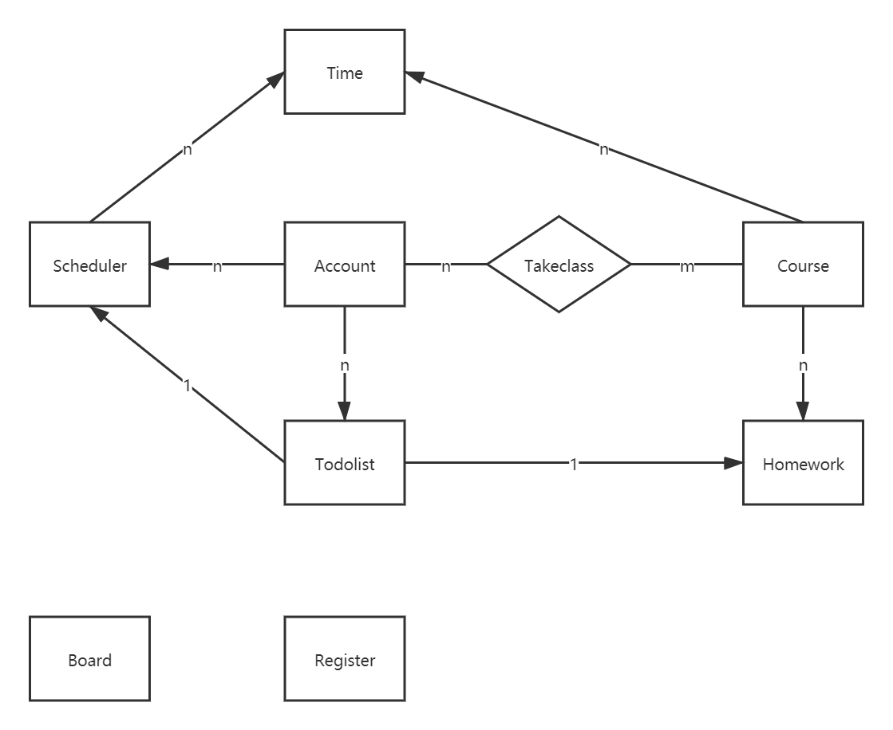

# 数据库模型介绍

## Account

用户信息，属性如下：
1. `user` django内嵌的用户对象
2. `email`
3. `gender`
4. `nickname`
5. `privilege` 表示用户的等级、比如老师、学生、助教或管理员等
6. `photo` 储存用户的头像

与其有关系的模型有：
1. 与`Course`的多对多关系，通过模型`Takeclass`实现，表示用户的课程。
2. 与`Scheduler`的一对多关系，表示用户的自定义事项。
3. 与`Todolist`的一对多关系，表示用户的待办事宜。

## Course

课程信息，属性如下：
1. `course_id` 自增主键
2. `course_name` 课程名称
3. `description` 课程简介

与其有关系的模型有：
1. 与`Time`的一对多关系，表示上课时间。
2. 与`Homework`的一对多关系，表示该门课作业。
3. 与`Account`的多对多关系。

## Scheduler

用户自定义事项，属性如下：
1. `scheduler_id` 自增主键
2. `account` 从属的用户
3. `title` 标题
4. `message` 详细信息

与其有关系的模型有：
1. 与`Time`的一对多关系，表示时间。
2. 与`Account`的多对一关系。

## Time

时间模型，属性如下：
1. `time_id` 自增主键
2. `course_time` 表示一个课表上的时间，比如星期一第一节课
3. `course` 从属的课程
4. `scheduler` 从属的用户自定义事项

与其有关系的模型有：
1. 与`Course`的多对一关系。
2. 与`Scheduler`的多对一关系。

## Homework

作业模型，属性如下：
1. `homework_id` 自增主键
2. `title` 标题
3. `message` 详细信息
4. `release_time` 作业发布时间
5. `deadilne_time` 作业DDL
6. `course` 从属课程

与其有关系的模型有：
1. 与`Course`的多对一关系。

## Todolist

待办事宜，属性如下：
1. `todolist_id` 自增主键
2. `account_id` 从属用户
3. `message` 详细信息
4. `deadline_time` DDL时间
5. `homework` 从属作业
6. `scheduler` 从属用户事项

## Takeclass

仅用于描述`Account`与`Course`之间的多对多关系

## Board

用来储存公告的模型，属性如下：
1. `board_id` 自增主键
2. `message` 详细信息
3. `time` 公告发布时间

## Register

储存注册相关的验证码的模型，属性如下：
1. `register_id` 自增主键
2. `username` 用户名
3. `password` 密码
4. `email` 邮箱
5. `checksum` 验证码
6. `time` 验证码发送时间

